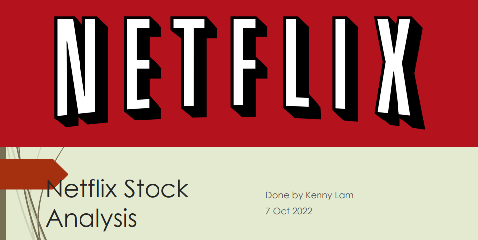

# Netflix-Capstone-Analysis
This is my capstone project for Vertical Institute Data Analytics course, all required data are in the pdf file, and all visualizations are done using tableau and can be accessed using this link: https://public.tableau.com/views/Capstone_16651429209540/NFLXstock?:language=en-US&:display_count=n&:origin=viz_share_link

Please start from the Netflix Capstone.pdf before heading to the tableau workbook to get a better understanding of the data viz

Thanks for reading




Badge [source](https://shields.io/)

# Key findings: Though Netflix remains as the biggest streaming service, its poor decision making over the years and lack of unique IPs has affected its earnings and stock prices, allowing its direct competitors to catch up in both earnings and stock prices, causeing it to nearly lose the title of the biggest streaming service.


## Authors

- [@kennylam365](https://www.github.com/kennylam365)

## Table of Contents

  - [Business problem](#business-problem)
  - [Data source](#data-source)
  - [Programs used](#programs-used)
  - [Data cleaning process](#data-cleaning-process)
  - [Quick glance at the results](#quick-glance-at-the-results)
  - [Assumptions and findings](#assumptions-and-findings)
  - [Lessons learned and recommendation](#lessons-learned-and-recommendation)
  - [Limitation and what can be improved](#limitation-and-what-can-be-improved)
  - [Run Locally](#run-locally)
  - [Explore the notebook](#explore-the-notebook)
  - [Deployment on streamlit](#deployment-on-streamlit)
  - [Repository structure](#repository-structure)
  - [Contribution](#contribution)
  - [Blog post](#blog-post)
  - [Project featuring](#project-featuring)
  - [License](#license)


## Business problem

As a beginner data analyst in an investment firm, you are tasked by your manager to analyze if Netflix is a company worth investing in due to the increase in streaming activities around the world caused by the pandemic. You are to use the publicly available information and statistics to conclude whether the company should invest in Netflix


## Data source

- [Netflix Financial Report](https://s22.q4cdn.com/959853165/files/doc_financials/2022/q2/Q2-22-Website-Financials.xlsx)
- [NFLX yahoo finance](https://finance.yahoo.com/quote/NFLX?p=NFLX)
- [AMZN yahoo finance](https://finance.yahoo.com/quote/AMZN?p=AMZN&.tsrc=fin-srch)
- [DIS yahoo finance](https://finance.yahoo.com/quote/DIS?p=DIS&.tsrc=fin-srch)

## Programs used

- Tableau (data vizualisation)

## Quick glance at the results

Netflix stock price.


Stock price over the last 2 years


Income vs stock price.


Netflix candle stick graph.


Subscriber Count


## Assumptions and findings

- **Though there is an upward trend over the past 5 years, the data from the past 2 years (2020 onwards) shows a downwards trend instead**
- **Income and stock price is directly proportionate, though there's usually a short delay due to earnings released only quarterly**
- **Candle stick graph over the last 2 years, especially 2022 onwards show much more red than blue (Opening price < Closing price)**
- **While Netflix remains as the biggest streaming service in subscriber count, its competitors, Amazon Prime and Disney+ have caught up by a large margin over the past years**

  - Netflix historical price for the past 2 years (2020 onwards) has been facing a downwards trend. The downward trend is mostly caused by 2 major crashes in 2022, on 21st January and 20 April due to Netflix announcing their first subscriber loss in history and their changes in their account holder policy respectively. This can be supported by the income vs stock price graph; as Netflix announced its much lower earnings in 2021 Q4, we see a huge drop in Q1 2022, which dropped further as Netflix made an announcement that they plan to charge primary account holders an extra fee for every “sub account,” or password sharer, to make up for lost revenue on 20th April.
  - The candle stick graph also showed much more red than blue from 2022 onwards, likely due to the reasons above, we can see the 2 major crashes on 20th Jan ($508 to 400) and 20th April ($333 to $245) within a day. While there are more blue boxes at the second half of the year, the price point is way below the trend line and reversal of the downtrend seems to be quite unlikely.
  - 

    ***Note***: There is always a trade-off between precision and recall. Choosing the right metrics depends on the problem you are solving.

    ***Conclusion***: Since the time I worked on this project (beginning 2022), we were in the longest bull market (excluding March 2020 flash crash) ever recorded; we will use recall as our metric.


 **Lessons learned and recommendation**

- Based on this project's analysis, income, family member headcount, and employment length are the three most predictive features in determining whether an applicant will be approved for a credit card. Other features like age and working employment status are also helpful. The least useful features are the type of dwelling and car ownership.
- The recommendation would be to focus more on the most predictive features when looking at the applicant profile and pay less attention to the least predictive features.

## Limitation and what can be improved

- Combine this model with with a regression model to predict how much of a credit limit an applicant will be approved for.
- Hyperparameter tuning with grid search or random search.
- Better interpretation of the chi-square test
- Retrain the model without the least predictive features


## Run Locally
Initialize git

```bash
git init
```


Clone the project

```bash
git clone https://github.com/semasuka/Credit-card-approval-prediction-classification.git
```

enter the project directory

```bash
cd Credit-card-approval-prediction-classification
```

Create a conda virtual environment and install all the packages from the environment.yml (recommended)

```bash
conda env create --prefix <env_name> --file assets/environment.yml
```

Activate the conda environment

```bash
conda activate <env_name>
```

List all the packages installed

```bash
conda list
```

Start the streamlit server locally

```bash
streamlit run cc_approval_pred.py
```
If you are having issue with streamlit, please follow [this tutorial on how to set up streamlit](https://docs.streamlit.io/library/get-started/installation)

## Explore the notebook

To explore the notebook file [here](https://nbviewer.org/github/semasuka/Credit-card-approval-prediction-classification/blob/main/Credit_card_approval_prediction.ipynb)

## Deployment on streamlit

To deploy this project on streamlit share, follow these steps:

- first, make sure you upload your files on Github, including a requirements.txt file
- go to [streamlit share](https://share.streamlit.io/)
- login with Github, Google, etc.
- click on new app button
- select the Github repo name, branch, python file with the streamlit codes
- click advanced settings, select python version 3.9 and add the secret keys if your model is stored on AWS or GCP bucket
- then save and deploy!

## App deployed on Streamlit


Video to gif [tool](https://ezgif.com/)
## Repository structure


```

├── assets
│   ├── confusion_matrix.png                      <- confusion matrix image used in the README.
│   ├── gif_streamlit.gif                         <- gif file used in the README.
│   ├── heatmap.png                               <- heatmap image used in the README.
│   ├── Credit_card_approval_banner.png           <- banner image used in the README.
│   ├── environment.yml                           <- list of all the dependencies with their versions(for conda environment).
│   ├── roc.png                                   <- ROC image used in the README.
│
├── datasets
│   ├── application_record.csv                    <- the dataset with profile information (without the target variable).
│   ├── credit_records.csv                        <- the dataset with account credit records (used to derive the target variable).
│   ├── test.csv                                  <- the test data (with target variable).
│   ├── train.csv                                 <- the train data (with target variable).
│
│
├── pandas_profile_file
│   ├── credit_pred_profile.html                  <- exported panda profile html file.
│
│
├── .gitignore                                    <- used to ignore certain folder and files that won't be commit to git.
│
│
├── Credit_card_approval_prediction.ipynb         <- main python notebook where all the analysis and modeling are done.
│
│
├── LICENSE                                       <- license file.
│
│
├── cc_approval_pred.py                           <- file with the model and streamlit component for rendering the interface.
│
│
├── README.md                                     <- this readme file.
│
│
├── requirements.txt                              <- list of all the dependencies with their versions(used for Streamlit).

```
## Contribution

Pull requests are welcome! For major changes, please open an issue first to discuss what you would like to change or contribute.

## Blog post

The accompanying blog post for this project can be found [here](https://semasuka.github.io/blog/2022/10/12/credit-card-approval-prediction.html)
