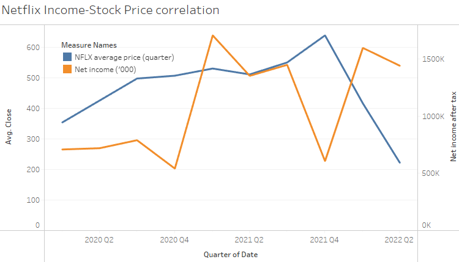

Badge [source](https://shields.io/)

# Key findings: Though Netflix remains as the biggest streaming service, its poor decision making over the years and lack of unique IPs has affected its earnings and stock prices, allowing its direct competitors to catch up in both earnings and stock prices, causeing it to nearly lose the title of the biggest streaming service.

## Authors

- [@kennylam365](https://www.github.com/kennylam365)

## Table of Contents

  - [Business problem](#business-problem)
  - [Data source](#data-source)
  - [Programs used](#programs-used)
  - [Quick glance at the results](#quick-glance-at-the-results)
  - [Assumptions and findings](#assumptions-and-findings)
  - [Lessons learned and recommendation](#lessons-learned-and-recommendation)
  - [Explore the visualization](#explore-the-visualization)

## Business problem

As a beginner data analyst in an investment firm, you are tasked by your manager to analyze if Netflix is a company worth investing in due to the increase in streaming activities around the world caused by the pandemic. You are to use the publicly available information and statistics to conclude whether the company should invest in Netflix

## Data source

- [Netflix Financial Report](https://s22.q4cdn.com/959853165/files/doc_financials/2022/q2/Q2-22-Website-Financials.xlsx)
- [NFLX yahoo finance](https://finance.yahoo.com/quote/NFLX?p=NFLX)
- [AMZN yahoo finance](https://finance.yahoo.com/quote/AMZN?p=AMZN&.tsrc=fin-srch)
- [DIS yahoo finance](https://finance.yahoo.com/quote/DIS?p=DIS&.tsrc=fin-srch)

## Programs used

- Tableau (data vizualisation)

## Quick glance at the results

Netflix stock price.

Stock price over the last 2 years

Income vs stock price.

Netflix candle stick graph.

Subscriber Count

Most attractive features of streaming services

Top reasons to cancel subscriptions

## Assumptions and findings

- **Though there is an upward trend over the past 5 years, the data from the past 2 years (2020 onwards) shows a downwards trend instead**
- **Income and stock price is directly proportionate, though there's usually a short delay due to earnings released only quarterly**
- **Candle stick graph over the last 2 years, especially 2022 onwards show much more red than blue (Opening price < Closing price)**
- **While Netflix remains as the biggest streaming service in subscriber count, its competitors, Amazon Prime and Disney+ have caught up by a large margin over the past years**

  - Netflix historical price for the past 2 years (2020 onwards) has been facing a downwards trend. The downward trend is mostly caused by 2 major crashes in 2022, on 21st January and 20 April due to Netflix announcing their first subscriber loss in history and their changes in their account holder policy respectively. This can be supported by the income vs stock price graph; as Netflix announced its much lower earnings in 2021 Q4, we see a huge drop in Q1 2022, which dropped further as Netflix made an announcement that they plan to charge primary account holders an extra fee for every “sub account,” or password sharer, to make up for lost revenue on 20th April.
  - The candle stick graph also showed much more red than blue from 2022 onwards, likely due to the reasons above, we can see the 2 major crashes on 20th Jan ($508 to 400) and 20th April ($333 to $245) within a day. While there are more blue boxes at the second half of the year, the price point is way below the trend line and reversal of the downtrend seems to be quite unlikely.
  - While Netflix remains as the biggest streaming service, Amazon Prime and Disney+ has nearly caught up in the subscriber count. There are some possible reasons for that; in an survey hosted by [Variety intelligence platform](https://read-vip.variety.com/html5/reader/production/default.aspx?pubname=&edid=2e949e33-9379-4a0d-95cf-ccf7609337cf), we can see that the top reasons for cancelling video streaming subscription services are price increase and content being removed, and the most attractive feature of a streaming service is having the desired shows; to make up for their subscriber and income loss in January 2022, Netflix has increased their subscription rates and also implemented an extra fee for each sub-account. Not to mention Netflix lack of IPs compared to its direct competitors along side the fact that their rights to stream many shows has also ended as the contract expires. e.g. Amazon Prime - Lord of the rings Disney+ - Marvel,  Starwars.

    ***Note***: Correlation does not mean there is a causal effect, further analysis required.

    ***Conclusion***: Netflix may not be a good investment choice based on all the points above.

 **Lessons learned and recommendation**

- Netflix poor decisions to increase its pricing while not having the unique selling points its competitors has caused both its revenue, subscribers and stock price to crash. Perhaps their confidence in making these decisions stems from the fact that Netflix used to be a monopoly for all streaming services years ago. While Disney and Amazon on the other hand, has been steadily growing and have their own large and unique IPs.
- The recommendation would be that instead of Netflix, perhaps the investment firm should look at other tech companies or streaming services, as  there are too much negative news revolving around Netflix, and now that their streaming services is not a monopoly anymore, there are other choices to consider instead.

## Explore the Visualization

To explore the visualization and interactive dashboard [here](https://public.tableau.com/views/NetflixCapstone_16787118044960/NFLXstock?:language=en-US&:display_count=n&:origin=viz_share_link)

Please start from the Netflix Capstone.pdf before heading to the tableau workbook to get a better understanding of the data viz

Thanks for reading.
